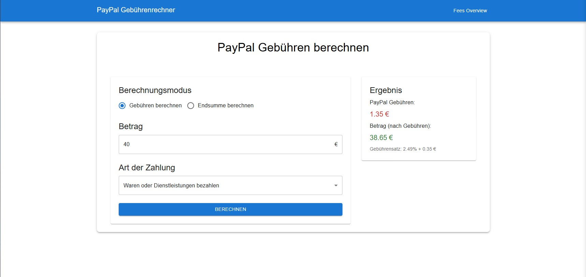

# PayPal Gebührenrechner (PayPal Fee Calculator)

This is a simple PayPal fee calculator that calculates the fees for sending and receiving money through PayPal. It also calculates the net amount that you will receive after the fees are deducted.



> **Note**: This application was made for the DACH region (Germany, Austria, Switzerland) with the fees for sending and receiving money within the European Union. The fees may vary depending on the country and the currency.

## Installation

This is only necessary, if you want to run the application locally. Visit the [live version](https://dikayx.github.io/paypal-gebuehrenrechner) if you just want to use the calculator.

1. Clone the repository:

    ```bash
    git clone https://github.com/dikayx/paypal-gebuehrenrechner
    ```

2. Install the dependencies:

    ```bash
    npm install
    ```

3. Run the application:

    ```bash
    npm start
    ```

4. Visit `http://localhost:3000` in your browser.

## License

This project is licensed under the MIT License - see the [LICENSE](LICENSE) file for details.
